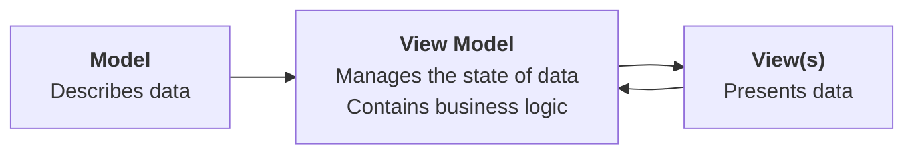

Most often this year, we have used arrays that hold a set number of elements, like in the Hobby Cards app:

![[Pasted image 20250220121040.png]]

For example, in the screenshot above, on lines 98 to 107, an array (also called a list) named `players` was created and holds six elements, with indices from 0 to 5:

|Index|Element|
|-|-|
|0|claireButorac|
|1|mikylaGrantMentis|
|2|akaneShiga|
|3|sophieShirley|
|4|sarahNurse|
|5|paytenLevis|

The use of an array allowed Mr. Gordon to [[Abstraction Using Lists|apply abstraction]] and create his Hobby Cards app, where users can swipe through a list of players in the [PWHL](https://www.thepwhl.com/en/):

   <div style="padding:56.25% 0 0 0;position:relative;">
	<iframe src="https://player.vimeo.com/video/1033841165?h=4dbfcb0c4c&amp;badge=0&amp;autopause=0&amp;player_id=0&amp;app_id=58479&portrait=0&byline=0&title=0" frameborder="0" allow="autoplay; fullscreen; picture-in-picture; clipboard-write" style="position:absolute;top:0;left:0;width:100%;height:100%;" title="Opening the Teamspace">
	</iframe>
	</div>
<script src="https://player.vimeo.com/api/player.js"></script>

This was a fun app to make, however, a great deal of the utility of using an array comes from its flexibility: the number of elements can be *increased* (or decreased) while our program runs.

For example, consider the following improvement to our app that allows for powers to be evaluated – it might be nice for users to see a list of previous calculations:

   <div style="padding:56.25% 0 0 0;position:relative;">
	<iframe src="https://player.vimeo.com/video/1058679175?h=d568a5a6b2&amp;badge=0&amp;autopause=0&amp;player_id=0&amp;app_id=58479&portrait=0&byline=0&title=0" frameborder="0" allow="autoplay; fullscreen; picture-in-picture; clipboard-write" style="position:absolute;top:0;left:0;width:100%;height:100%;" title="Opening the Teamspace">
	</iframe>
	</div>
<script src="https://player.vimeo.com/api/player.js"></script>

A similar app that performs more complex calculations and provides a way to save prior results might be even more useful.

For example, say that you are working through a problem set in Physics that requires kinematics equations – it might be useful to see previous equations you have solved using an app, similar to the way you can call back prior calculations made on a handheld calculator.

## Understanding the data structure

Before you learn how to build out an app that can save a history of results, let's take just a bit of time to explore the structure of an array (also known as a list) again.

### Initializing an array

Create a new [[Command-Line Projects|command-line macOS app]] named **DynamicListExamples**, and then copy this code into the `main` file:

```swift
// Create an array of integers that
// holds three random numbers to start
var numbers: [Int] = [

    Int.random(in: 1...100),
    Int.random(in: 1...100),
    Int.random(in: 1...100),

]

// Print the values in the array
for number in numbers {
    print(number)
}
```

... like this:

![[Screenshot 2024-01-29 at 4.36.24 PM.png]]

Run the app a few times by using the **Command-R** keyboard shortcut.

Notice how the numbers in the array change each time. That is because they are randomly generated.

However, there are *always three* elements in the array.

Three elements will exist at indices 0 through 2, inclusive, like this (using values from the screenshot above):

|Index|Element|
|-|-|
|0|56|
|1|77|
|2|59|

You can check for yourself that this is in fact how the array is organized.

Click the left margin of the Xcode interface, where it says line 21, then run your app:

![[Screenshot 2024-01-29 at 4.54.51 PM.png]]

The blue mark in the margin is a *breakpoint*, and you are now debugging your app in real-time.

The green line indicates the line of code that is about to be run. We will use this in a moment.

For now, click near the bottom of the Xcode interface, where it says **Auto↕**, and then select **All Variables, Registers, Globals and Statics**, like this:

![[Screenshot 2024-01-29 at 4.55.15 PM.png]]

You should then see the following:

![[Screenshot 2024-01-29 at 4.59.16 PM.png]]

Finally, click the disclosure triangle beside `numbers` and you will see the three existing values in the array, and index positions 0, 1, and 2:

![[Screenshot 2024-01-29 at 4.58.21 PM.png]]

If you wish, you can step through the code. Press the **Step Over** button a few times, and you will see the loop print the numbers in the array to the console:

![[Stepping Through Code.mp4]]

### Mutating the array

However, what if we want to add more values to the array?

When a data structure is changed, we say it is *mutated*.

We could do this by adding more lines of code after the existing code:

```swift
// Add two more random numbers to the array
numbers.append(Int.random(in: 1...100))
numbers.append(Int.random(in: 1...100))

// Print a divider
print("----------")

// Print the values in the array again
for number in numbers {
    print(number)
}
```

... like this – all the code on lines 25 and below is new:

![[Screenshot 2024-01-29 at 5.10.03 PM.png]]

With the new code, from the screenshot above, at first the array contains just three values:

|Index|Element|
|-|-|
|0|21|
|1|35|
|2|55|

However, after the additional elements are appended (added to the end) of the array, it contains:

|Index|Element|
|-|-|
|0|21|
|1|35|
|2|55|
|3|82|
|4|51|

This demonstrates that you *can* mutate, or change, the number of elements in an array after the array is first initialized.

Try this out by running the code and stepping through it – notice how the size of the array changes as the additional lines of code are run:

![[More Stepping Through Code.mp4]]

However, we, as the programmer, are still deciding to add two more elements, and *we* are writing the code to make that happen.

What if we want to change the elements in the array at *run time*?

That is... while the program is running?

By letting the user decide?

We can do that.

### Mutating at run time

First, let's clear the breakpoint on line 21, like this:

![[Clearing a Breakpoint.mp4]]

Then add the code below to the bottom of the existing code in your app:

```swift
// Print a divider
print("----------")

// Ask the user how many more numbers to add to the array
print("How many more elements would you like to add to the array? ", terminator: "")
let additionalElementCount = Int(readLine()!)!

// Prompt the user to add more elements
for _ in 0..<additionalElementCount {
    print("Please enter a number: ", terminator: "")
    let newValue = Int(readLine()!)!
    numbers.append(newValue)
}

// Print a divider
print("----------")

// Print the values in the array a third time
for number in numbers {
    print(number)
}
```

... like this – everything on line 37 and after is new:

![[Screenshot 2024-01-29 at 5.23.41 PM.png]]

Now set a breakpoint on line 38, and another breakpoint on line 52, like this:

![[Screenshot 2024-01-29 at 5.28.32 PM.png]]

Try running the program.

It will stop just before the user – you – will be prompted to add more elements to the array.

Notice how there are currently *five* elements in the array:

![[Screenshot 2024-01-29 at 5.29.33 PM.png]]

If you press the **Continue program execution** button:

![[Screenshot 2024-01-29 at 5.30.35 PM.png]]

... you will be prompted to add as many new elements to the array as you want.

Choosing a value less than 10 is recommended unless you *really* enjoy typing numbers into a computer!

Notice that when the program stops at the second breakpoint, the size of the array has grown by however many elements you chose to add:

![[Adding Elements to an Array.mp4]]

So, that is a recap of how arrays are structured.

We have shown that we can place elements in an array:

- when it is first initialized
	- this is what we did in Hobby Cards, Landmarks, and similar apps
- after it is initialized
	- we can change an array's contents after it is first created
- at run time
	- the user can control how many new elements are added to an array

> [!TIP]
> 
> Run the command line program we just wrote again.
> 
> Try typing something other than a number in when prompted.
> 
> For example, type `five` rather than `5`.
> 
> What happens? Why do you think that happened? Write your response in your Notion post for today before continuing.
> 
> More on how to handle this later...

## Use a dynamic array

From our look at [[Separation of Concerns]] you know the high-level purpose of each layer in MVVM design pattern:



As we did when originally authoring the app to calculate powers, we will start with the data, by adjusting the view model to hold our array containing previous calculations.

### Adjust the view model

#### Add the array

We need a place to store *state* – that is – the history of previously calculated powers that we want to keep around to review in our app.

Take this code:

```swift
// Holds the list of previously computed and evaluated powers
var resultHistory: [Power] = []
```

... and add it to your the view model, like this:

![[Pasted image 20250220125353.png]]

This creates a new stored property named `resultHistory`.

The type annotation of `[Power]` indicates that the stored property will hold an array of instances of the `Power` data type – recall that square brackets – `[` and `]` denote the start and end of an array in Swift.

Finally, the stored property is assigned an empty array by default – that is what the syntax `= []` means.

> [!NOTE]
> 
> Since we are assigning an empty array by default to the `resultHistory` stored property, no changes to the initializer of `PowerViewModel` are required.
> 
> When an instance of `PowerViewModel` is created, `resultHistory` will be automatically initialized with an empty array.

#### Add a function

Our view model needs a way for the view to say:

> "Hey, take this power the user has calculated, and add it to your array that keeps track of their previous calculations."

So, we can use this code – copy it into your computer's clipboard:

```swift
// MARK: Function(s)
func saveResult() {
	
	// When there is a valid power based on user input...
	if let power = self.power {
		
		// ... save that evaluated power at the top of the history of 
		// results
		//
		// NOTE: By inserting the newly evaluated power at the top of 
		//       the array, we ensure the user sees
		//       the most recent result first.
		self.resultHistory.insert(power, at: 0)
	}
	
}
```

... and paste it below the initializer in the view model, but before the end of the class:

![[Pasted image 20250220130130.png]]

> [!NOTE]
> 
> A function is just a way to *encapsulate* (contain) some logic that we want to happen at a certain point in time within our app.

Although we are not yet done implementing the new feature to save prior calculations, this is a good time to [[Pushing Commits|commit and push]] our work with the message:

```
Made view model changes to support saving a history of previous calculations.
```

### Adjust the view

#### Add a button

When our view shows a power that has been evaluated, we should also show a button that allows the user to save that result.

Copy this code into your computer's clipboard:

```swift
// Add a button so that the result can be saved
Button {
	viewModel.saveResult()
	// DEBUG: Show how many items are in the resultHistory array
	print("There are \(viewModel.resultHistory.count) elements in the resultHistory array.")
} label: {
	Text("Save")
}
.buttonStyle(.borderedProminent)
.padding(.bottom)
```

... then locate the end of the `HStack` that shows the evaluated result:

![[Pasted image 20250220130532.png]]

.. and paste new code after that `HStack` but before the `else` branch:

![[Pasted image 20250220131602 1.png]]

Now let's try out the code we've added to the view model and the view.

Start the Xcode Previews window, if necessary, by pressing **Option-Command-P**. Then click this icon in the lower left corner of the Xcode window, or, press the **Shift-Command-Y** keyboard shortcut to show the Debug Area:

![[Pasted image 20250220132000.png]]

Now try typing in a power, and then saving the evaluated result. You should see the count of elements in the view model's `resultHistory` array increasing each time you press the button:

   <div style="padding:56.25% 0 0 0;position:relative;">
	<iframe src="https://player.vimeo.com/video/1058693083?h=dd3eb2aca2&amp;badge=0&amp;autopause=0&amp;player_id=0&amp;app_id=58479&portrait=0&byline=0&title=0" frameborder="0" allow="autoplay; fullscreen; picture-in-picture; clipboard-write" style="position:absolute;top:0;left:0;width:100%;height:100%;" title="Opening the Teamspace">
	</iframe>
	</div>
<script src="https://player.vimeo.com/api/player.js"></script>

This is a good time to [[Pushing Commits|commit and push]] your work with the following message:

```
Added a button to the view to invoke the function from the view model that saves an evaluated power to our history of previously evaluated powers.
```

## Reflection questions

When you write a portfolio entry for this lesson, please try responding to the questions below.

> [!NOTE]
> 
> Since thinking about what you learned today, and making the effort to articulate your ideas in writing is the point of responding to these questions, please do not use a large language model such as ChatGPT to come up with responses.
> 
> By thinking about your responses to these questions on your own, you will better prepare yourself for upcoming conversation-based evaluations in this module of the course. As a group, we will soon speak at greater length together about what these conversation-based evaluations are. Note that every student in the class will complete a conversation-based evaluation at least once before the end of this module.

1. In your own words, explain the difference between a static array and a dynamic array. 
2. How can breakpoints help you understand the structure and contents of an array during runtime? Describe the steps you followed to inspect the `numbers` array using breakpoints.
3. What happens when you enter a non-numeric value as input for the number of additional elements to add to the array? Why does this occur? How do you prevent the program from crashing in this scenario?
4. Compare the dynamic arrays you worked with in this tutorial to a real-world app you use (e.g., a shopping cart in an online store). How might the concepts of array mutation and user interaction apply in that context?